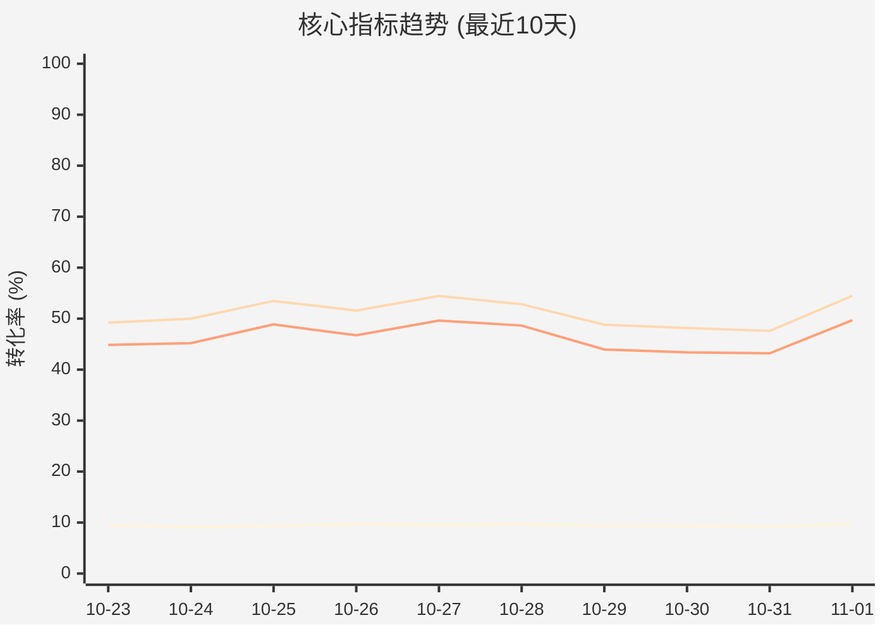
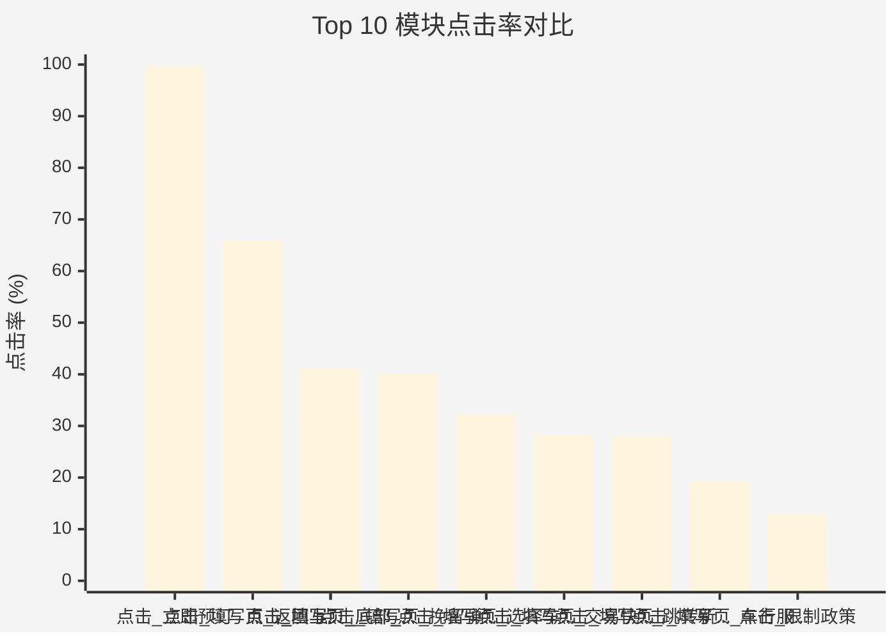

# 📊 模块转化效能深度分析报告
**生成时间**: 2026-01-15 23:02:30
**数据来源**: 填写页.xlsx
**分析数据量**: 2,196 条记录

---

## 1. 📋 核心指标总览

| 指标 | 数值 |
| :--- | :--- |
| **整体点击率 (CTR)** | **9.28%** |
| **整体点击转化率 (Click CVR)** | **49.44%** |
| **整体下单转化率 (Order CVR)** | **44.82%** |
| 总曝光人数 | 42,868,217 |
| 总点击人数 | 3,977,159 |
| 总转化人数 | 1,966,126 |
| 总下单人数 | 1,782,729 |

## 2. 🏆 Top 50 高点击率模块榜单

按点击率降序排列，展示表现最优秀的模块:

| 排名 | 模块名称 | 曝光人数 | 点击人数 | **点击率(CTR)** | 点击转化率 | 下单转化率 |
| :---: | :--- | ---: | ---: | ---: | ---: | ---: |
| 1 | 点击_立即预订 | 757,557 | 754,150 | **99.55%** | 31.4% | 28.61% |
| 2 | 点击_填写页_返回上级页面 | 772,837 | 509,705 | **65.95%** | 27.84% | 25.02% |
| 3 | 点击_填写页_底部_费用明细 | 772,837 | 317,410 | **41.07%** | 32.39% | 29.32% |
| 4 | 点击_填写页_挽留弹窗 | 757,557 | 304,134 | **40.15%** | 29.76% | 27.02% |
| 5 | 点击_填写页_选择车行服务 | 757,557 | 244,699 | **32.3%** | 39.57% | 36.2% |
| 6 | 点击_填写页_底部_去支付 | 772,837 | 240,192 | **31.08%** | 102.79% | 93.68% |
| 7 | 点击_填写页_交易快照 | 772,837 | 217,813 | **28.18%** | 113.19% | 103.17% |
| 8 | 点击_填写页_跳转新版订单详情页 | 772,837 | 215,516 | **27.89%** | 113.28% | 103.74% |
| 9 | 点击_填写页_车行服务_服务内容区域 | 757,557 | 145,851 | **19.25%** | 40.64% | 36.82% |
| 10 | 点击_限制政策 | 757,557 | 98,173 | **12.96%** | 40.02% | 36.22% |
| 11 | 点击_详情页_增值服务_选择 | 3,787,785 | 433,515 | **11.45%** | 41.29% | 37.62% |
| 12 | 点击_门店信息 | 757,557 | 65,678 | **8.67%** | 47.41% | 41.87% |
| 13 | unkwn | 15,280 | 1,165 | **7.62%** | 77.6% | 67.64% |
| 14 | 点击_车行服务详情页_升级或选择此服务按钮 | 757,557 | 55,081 | **7.27%** | 47.51% | 43.39% |
| 15 | 点击_填写页_取还车地图及指引 | 757,557 | 53,172 | **7.02%** | 55.03% | 49.47% |
| 16 | 点击_填写页_支付方式_2 | 15,280 | 750 | **4.91%** | 92.13% | 80.53% |
| 17 | 点击_填写页_航班延迟政策 | 15,280 | 727 | **4.76%** | 106.88% | 92.71% |
| 18 | 点击_填写页_驾驶员信息_选择区号 | 15,280 | 724 | **4.74%** | 101.93% | 90.19% |
| 19 | 点击_填写页_支付方式_1 | 15,280 | 661 | **4.33%** | 90.32% | 79.27% |
| 20 | 点击_填写页_门店政策_顶部 | 757,557 | 31,381 | **4.14%** | 52.22% | 46.09% |
| 21 | 点击_填写页_驾驶员更多和新增 | 757,557 | 28,118 | **3.71%** | 70.9% | 64.92% |
| 22 | 点击_填写页_支付方式_3 | 13,105 | 379 | **2.89%** | 95.25% | 79.68% |
| 23 | 点击_填写页_驾驶员信息_常旅 | 772,837 | 18,946 | **2.45%** | 70.6% | 61.74% |
| 24 | 点击_门店弹层_评价tab | 757,557 | 18,003 | **2.38%** | 49.18% | 43.47% |
| 25 | 填写页押金模块_去授权按钮_点击埋点 | 5,199 | 122 | **2.35%** | 86.07% | 70.49% |
| 26 | 点击_芝麻弹层_确认 | 4,716 | 108 | **2.29%** | 89.81% | 76.85% |
| 27 | 点击_门店弹层_费用tab | 757,557 | 16,192 | **2.14%** | 47.18% | 41.23% |
| 28 | 点击_驾驶员列表页_添加驾驶员 | 758,089 | 15,547 | **2.05%** | 69.65% | 55.08% |
| 29 | 点击_填写页_右上角侧边栏按钮点击 | 488 | 10 | **2.05%** | 80.0% | 60.0% |
| 30 | 点击_门店弹层_订前必读tab | 757,557 | 14,504 | **1.91%** | 51.08% | 44.95% |
| 31 | 点击_产品详情页_门店弹层_查看全部评价 | 757,557 | 14,317 | **1.89%** | 43.61% | 38.8% |
| 32 | 点击_填写页_优惠券 | 772,837 | 14,132 | **1.83%** | 59.01% | 51.85% |
| 33 | 点击_取车时间不足弹框_调整时间 | 757,557 | 13,447 | **1.78%** | 111.59% | 103.12% |
| 34 | 点击_填写页_额外驾驶员说明_按钮 | 757,557 | 12,939 | **1.71%** | 69.29% | 62.8% |
| 35 | 点击_产品详情页_门店弹层_查看更多门店政策 | 757,557 | 12,910 | **1.7%** | 44.78% | 40.5% |
| 36 | 点击_填写页_查看理赔须知 | 757,557 | 11,969 | **1.58%** | 44.16% | 39.76% |
| 37 | 点击_填写页_表单验证 | 772,837 | 10,070 | **1.3%** | 81.92% | 68.27% |
| 38 | 点击_门店弹层_详情tab | 757,557 | 9,398 | **1.24%** | 51.6% | 45.45% |
| 39 | 点击_详情页_附加产品 | 757,557 | 8,294 | **1.09%** | 49.08% | 45.55% |
| 40 | 点击_详情页_租车保障 | 757,557 | 7,002 | **0.92%** | 58.67% | 43.79% |
| 41 | 点击_不可用优惠券tab | 757,557 | 6,343 | **0.84%** | 58.62% | 51.47% |
| 42 | 点击_详情页_增值服务_取消 | 1,515,114 | 10,631 | **0.7%** | 55.9% | 50.82% |
| 43 | 点击_填写页_驾驶员信息_选择联系人 | 758,062 | 5,262 | **0.69%** | 73.81% | 64.75% |
| 44 | 点击_取车时间不足弹框_关闭 | 757,557 | 4,758 | **0.63%** | 97.12% | 87.81% |
| 45 | 点击_产品详情页_门店弹层_地图及指引 | 757,557 | 4,645 | **0.61%** | 52.03% | 44.84% |
| 46 | 点击_产品详情页_门店弹层_门店实拍 | 757,557 | 4,318 | **0.57%** | 47.01% | 40.94% |
| 47 | 点击_产品详情页_门店弹层_查看无忧租 | 757,557 | 2,887 | **0.38%** | 54.35% | 46.9% |
| 48 | 点击_填写页_费用明细_小时费收费规则 | 757,557 | 2,807 | **0.37%** | 44.78% | 40.58% |
| 49 | 点击_填写页_活动模块 | 757,557 | 2,797 | **0.37%** | 52.59% | 45.48% |
| 50 | 点击_详情页_无忧租特权 | 757,557 | 2,702 | **0.36%** | 55.22% | 47.85% |

## 3. 📈 可视化看板

### 漏斗趋势图

### Top 10模块点击率

## 4. 💡 业务洞察与优化建议

### 🔍 漏斗流失分析

最大流失环节: **曝光到点击**，流失率 90.72%
- 曝光到点击: 90.72% 用户未点击
- 点击到转化: 50.56% 用户点击后未提交订单
- 转化到下单: 55.18% 用户提交后未完成预订

### 🏆 高价值模块推荐

以下模块点击率最高，建议重点推广:
- **点击_立即预订**: CTR 99.55%, 下单CVR 28.61%
- **点击_填写页_返回上级页面**: CTR 65.95%, 下单CVR 25.02%
- **点击_填写页_底部_费用明细**: CTR 41.07%, 下单CVR 29.32%
- **点击_填写页_挽留弹窗**: CTR 40.15%, 下单CVR 27.02%
- **点击_填写页_选择车行服务**: CTR 32.3%, 下单CVR 36.2%

### ⚠️ 低效模块预警

以下模块曝光量大但点击率低，需优化:
- **点击_填写页_驾驶员信息_常旅**: CTR 2.45% (曝光 772,837)
- **点击_驾驶员列表页_添加驾驶员**: CTR 2.05% (曝光 758,089)
- **点击_填写页_优惠券**: CTR 1.83% (曝光 772,837)
- **点击_填写页_表单验证**: CTR 1.3% (曝光 772,837)
- **点击_详情页_增值服务_取消**: CTR 0.7% (曝光 1,515,114)

### 💡 业务优化建议

**针对曝光到点击环节流失:**
- 优化模块视觉设计，提升吸引力
- 调整模块位置，增加曝光质量
- A/B测试不同的文案和图片

## 5. 📎 附录

### 指标计算公式

1. **模块点击率 (CTR)** = `(点击人数 / 曝光人数) × 100%`
2. **点击转化率 (Click CVR)** = `(转化人数 / 点击人数) × 100%`
3. **下单转化率 (Order CVR)** = `(下单人数 / 点击人数) × 100%`

### 数据清洗规则

- 剔除点击量 < 10 的长尾数据
- 剔除点击 > 曝光的异常数据
- 所有指标保留2位小数

---

*🤖 本报告由数据分析工具自动生成*
